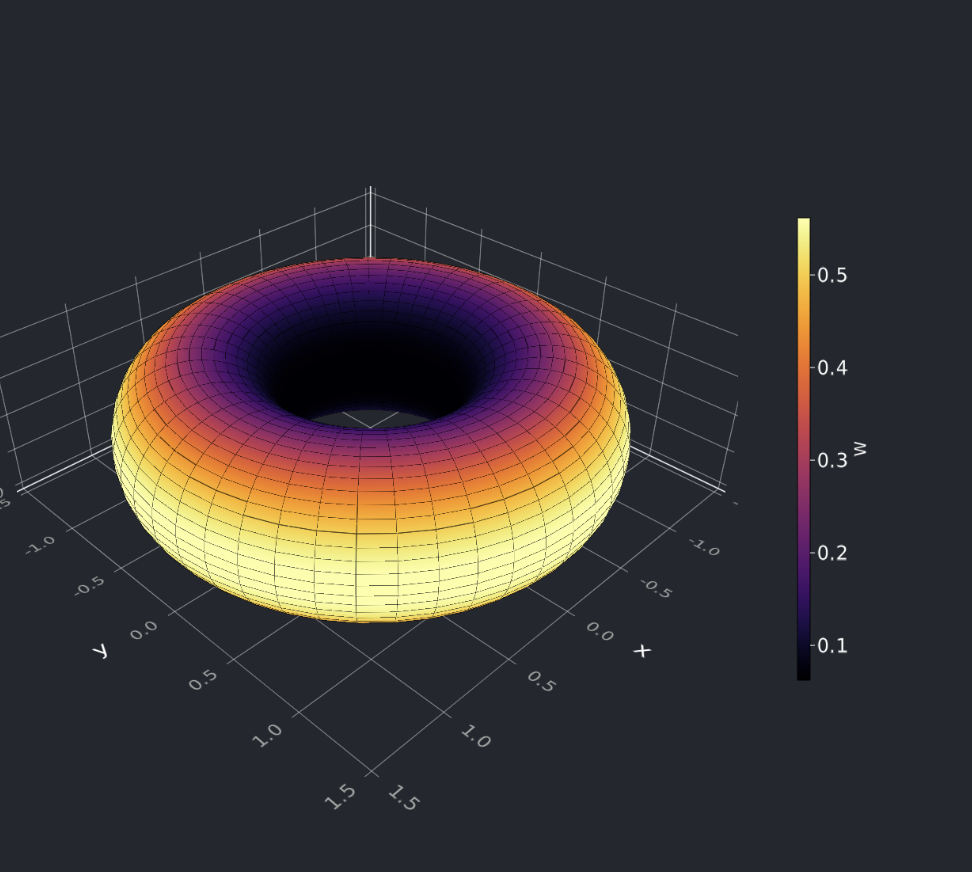

# DifferentialGeometry

## Done
- [x] basic manifold types (1, 2 dimensional)
- [x] basic embedding functionality (2 dimensional)
- [x] basic embedded manifold visualization
- [x] geometry: normal, metric deformation, jacobian...

## TODO
### Basic
- [ ] Test on curves
- [ ] `sample(m)` allow for different sampling over each dimension

### Intermediate
- [ ] tangent vectors + visualization
- [ ] tangent vector fields
- [ ] parallel transport?
- [ ] some n-forms stuff?

### Advanced
- [ ] Laplace Beltrami operator: https://en.wikipedia.org/wiki/Laplace%E2%80%93Beltrami_operator
see also Sec 8.3 here: http://alice.loria.fr/publications/papers/2007/SigCourseParam/param-course.pdf
- [ ] global parametrization, see Sec 8: http://alice.loria.fr/publications/papers/2007/SigCourseParam/param-course.pdf

